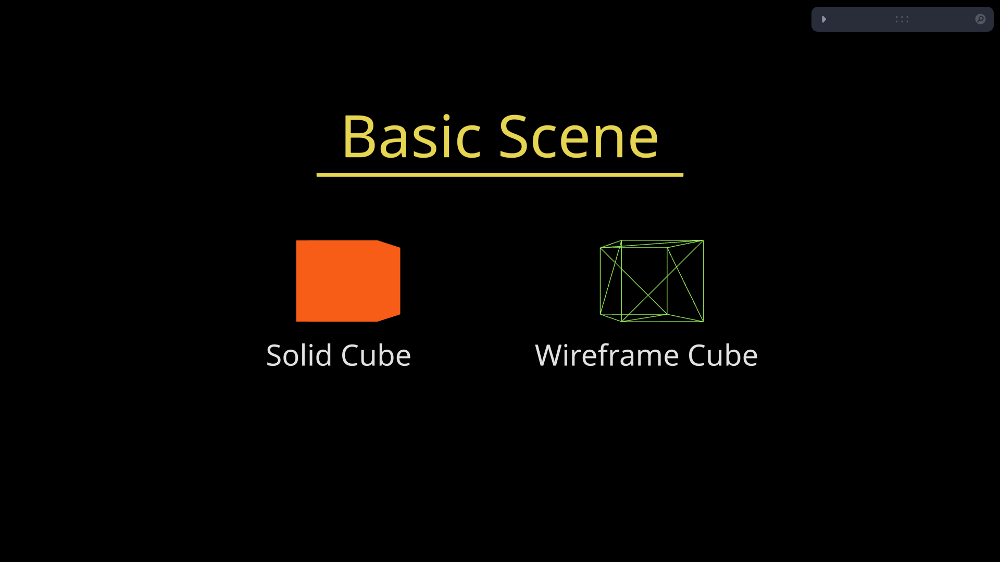

# 🧊 Basic Scene (Cubes)

A simple 3D scene featuring two cubes — one solid and one wireframe — built using [React Three Fiber (R3F)].
## 🧰 Tech Stack

- React
- React Three Fiber
- Three.js
- Vite

## 📦 Installation

 - npm install
 
## 🖥️ Run Locally

 - npm run dev

## 📸 Preview

## 🧠 Inspired By

 [Bruno Simon's Three.js Journey](https://threejs-journey.com/) — an incredible resource for learning Three.js interactively!
